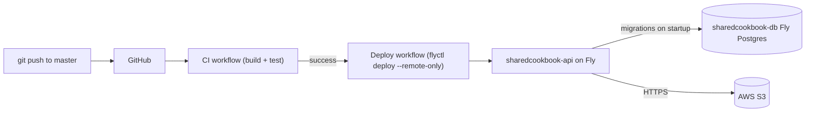

# Deploy

How the SharedCookbook API is deployed.


| Doc                                      | What it covers                                                  |
| ---------------------------------------- | --------------------------------------------------------------- |
| [fly.md](./fly.md)                       | The Fly.io setup: `fly.toml`, Postgres, secrets, manual deploys |
| [github-actions.md](./github-actions.md) | How changes to `master` auto-deploy via GitHub Actions          |


## Quick mental model




- **API**: `sharedcookbook-api.fly.dev` — .NET 10 Docker image built from [Dockerfile](../../Dockerfile).
- **Database**: `sharedcookbook-db` — separate Fly app, Fly Postgres (unmanaged), persistent volume. **Not** rebuilt on API deploys.
- **Secrets**: `fly secrets set` (never committed). See [fly.md](./fly.md#secrets).

## Common commands

```powershell
fly status   --app sharedcookbook-api
fly logs     --app sharedcookbook-api
fly deploy   --app sharedcookbook-api   # manual escape hatch
fly secrets list --app sharedcookbook-api
fly postgres connect -a sharedcookbook-db
```

